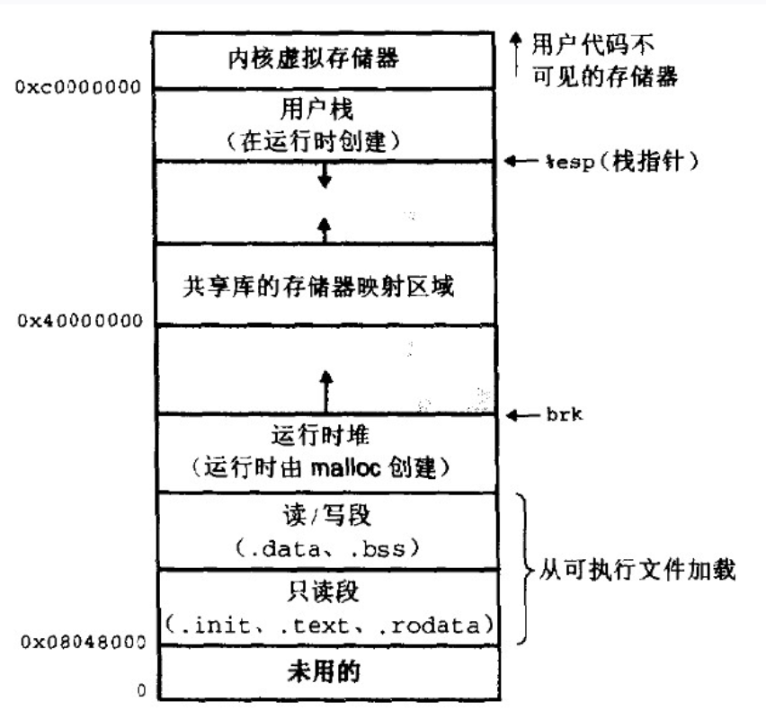
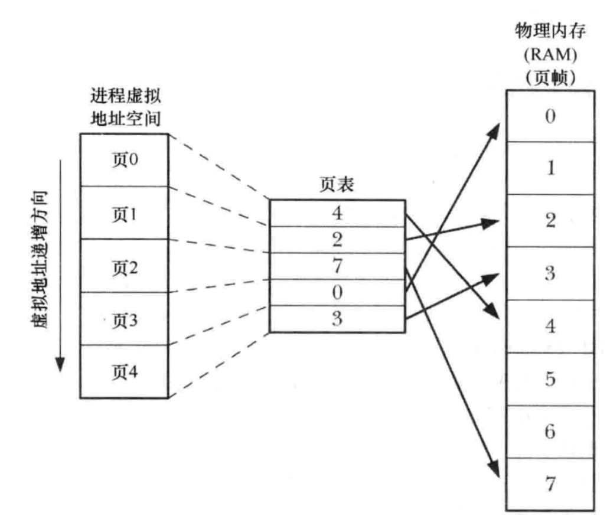
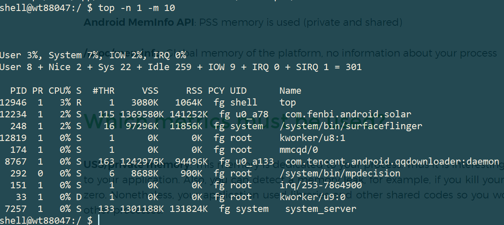
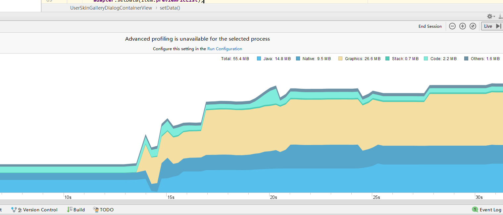
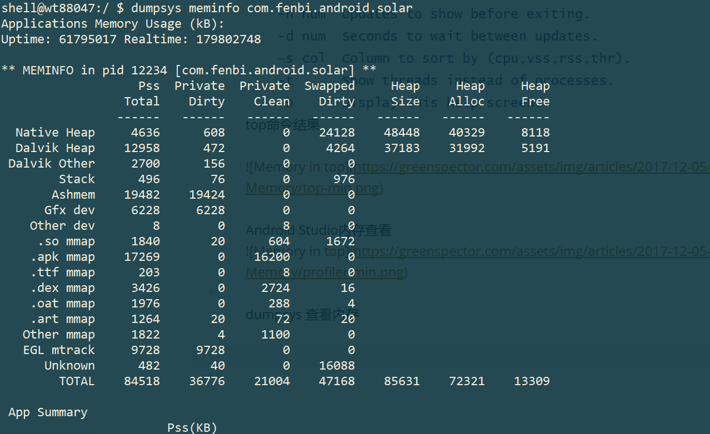
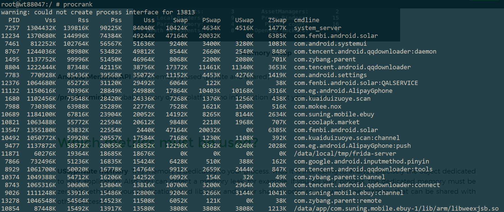
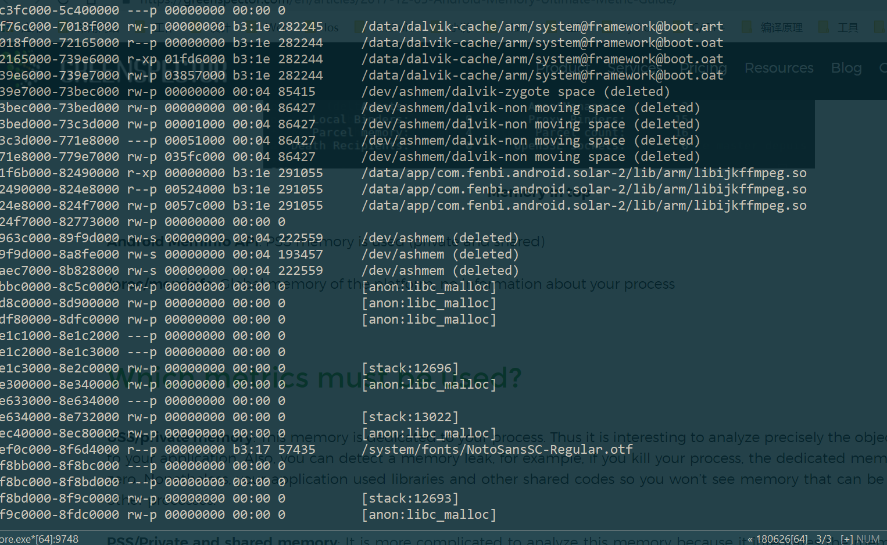
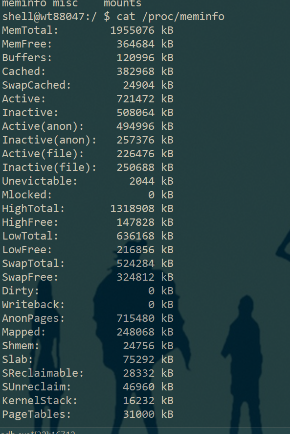

# Android内存管理

## 为什么要关注内存

参考：https://developer.android.google.cn/studio/profile/memory-profiler

Android 提供一个[托管内存环境](https://developer.android.google.cn/topic/performance/memory-overview.html)—当它确定您的应用不再使用某些对象时，垃圾回收器会将未使用的内存释放回堆中。 虽然 Android 查找未使用内存的方式在不断改进，但对于所有 Android 版本，系统都必须在某个时间点短暂地暂停您的代码。 大多数情况下，这些暂停难以察觉。 不过，如果您的应用分配内存的速度比系统回收内存的速度快，则当收集器释放足够的内存以满足您的分配需要时，您的应用可能会延迟。 此延迟可能会导致您的应用跳帧，并使系统明显变慢。

尽管您的应用不会表现出变慢，但如果存在内存泄漏，则即使应用在后台运行也会保留该内存。 此行为会强制执行不必要的垃圾回收 Event，因而拖慢系统的内存性能。 最后，系统被迫终止您的应用进程以回收内存。 然后，当用户返回您的应用时，它必须完全重启。

## Linux 内存管理
### 虚拟内存和物理内存
* 每个进程都有自己独立的4G内存空间，各个进程的内存空间具有类似的结构
* 一个新进程建立的时候，将会建立起自己的内存空间，此进程的数据，代码等从磁盘拷贝到自己的进程空间，哪些数据在哪里，都由进程控制表中的task_struct记录，task_struct中记录中一条链表，记录中内存空间的分配情况，哪些地址有数据，哪些地址无数据，哪些可读，哪些可写，都可以通过这个链表记录
* 每个进程已经分配的内存空间，都与对应的磁盘空间映射



* 每个进程的4G内存空间只是虚拟内存空间，每次访问内存空间的某个地址，都需要把地址翻译为实际物理内存地址
* 所有进程共享同一物理内存，每个进程只把自己目前需要的虚拟内存空间映射并存储到物理内存上。
* 进程要知道哪些内存地址上的数据在物理内存上，哪些不在，还有在物理内存上的哪里，需要用页表来记录
* 页表的每一个表项分两部分，第一部分记录此页是否在物理内存上，第二部分记录物理内存页的地址（如果在的话）当进程访问某个虚拟地址，去看页表，如果发现对应的数据不在物理内存中，则缺页异常。.缺页异常的处理过程，就是把进程需要的数据从磁盘上拷贝到物理内存中，如果内存已经满了，没有空地方了，那就找一个页覆盖，当然如果被覆盖的页曾经被修改过，需要将此页写回磁盘。
* 当一个逻辑地址, 经过MMU映射后发现, 对应的页表项还没有映射到物理内存, 就会触发缺页错误(page fault): CPU 需要陷入 kernel, 找到一个可用的物理内存页面, 从页表项映射过去。如果这个时候没有空闲的物理内存页面, 就需要做页面置换了, 操作系统通过某些算法, 从物理内存中选一个当前在用的页面, (是否需要写到磁盘, 取决于有没有被修改过), 重新调入, 建立页表项到之的映射关系.
* 在每个进程创建加载时，内核只是为进程“创建”了虚拟内存的布局，具体就是初始化进程控制表中内存相关的链表，实际上并不立即就把虚拟内存对应位置的程序数据和代码（比如.text .data段）拷贝到物理内存中，只是建立好虚拟内存和磁盘文件之间的映射就好（叫做存储器映射），等到运行到对应的程序时，才会通过缺页异常，来拷贝数据。还有进程运行过程中，要动态分配内存，比如malloc时，也只是分配了虚拟内存，即为这块虚拟内存对应的页表项做相应设置，当进程真正访问到此数据时，才引发缺页异常。(参考：https://www.linuxidc.com/Linux/2015-02/113981.htm)




```java
                     +----------------+ 0xFFFFFFFF
                     | Kernel Space   |
                     +----------------+ 0xC0000000
                     |   User Space   |
                     | +------------+ |              +-------------------+
                     | |   Stack    | |              | +---------------+ |
                     | +------------+ |              | |Physical Page n| |
+-------------+      / .    ...     . /              | +---------------+ |
|             |      / .    ...     . /              / .    ......     . /
| +---------+ |      | +------------+ |              / .    ......     . /
| |   ...   | |      | |    Heap    | |              | .    ......     . |
| +---------+ |      | +------------+ |              | +---------------+ |
| |  .data  |-+------+>|    Data    |-+--------------+>|Physical Page 2| |
| +---------+ |  OS  | +------------+ |     MMU      | +---------------+ |
| |  .text  |-+------+>|    Code    |-+--------------+>|Physical Page 1| |
| +---------+ |      | +------------+ |              | +---------------+ |
| |   ...   | |      | |  Reversed  | |              | |Physical Page 0| |
| +---------+ |      | +------------+ |              | +---------------+ |
+-------------+      +----------------+ 0x00000000   +-------------------+
    ELF File         Virtual Address Space              Physical Memory
```


linux虚拟内存管理可以参考 https://cloud.tencent.com/developer/article/1157420

## 一些概念

pages:用于从磁盘读取数据到内存，是虚拟内存管理的主要部分。大部分页大小是4k。

private/shared memory : pivate memory 是进程独占的内存。shared memory 内存同时被其他进程引用。如果有其他进程引用pivate memory 则会转换为shared memory

Clean / Dirty memory: Dirty pages 内存已被改写，无法转存。clean pages 是可以被转存的数据。

vss: 进程所引用的所有的pages。包含了所有的private/shared pages, 并且包含了诸如malloc申请了未使用的pages

rss : 进程实际使用的物理内存的大小，包含了shared pages。

pss:进程实际使用的物理内存的大小，包含了平均后的shared pages。

uss:进程独占的pages

Java / native memory: Java内存是由Android Dalvik 或者 ART管理的内存。native memory是native代码申请的内存。即使应用程序自己没有使用native代码，Android系统也会使用一些native函数。

Zram:Android 没有交换内存，Zram是压缩后的数据，也是存储在ram中。等价于meminfo中swapped dirty

stack/heap: heap 是对象内存。stack是局部变量咱用的内存。

mmap:将文件map到内存中。Android中诸如Dex、APK、ART都会被mmap到内存中

Graphics Buffer : 用来存储ui元素的内存

User/Kernal memory : 进程在用户态/在内核态使用的内存

## 内存组织方式

Android的内存通过虚拟地址来管理。内存的组织方式如下：升序地址
* 用户空间
  * 数据段
  * heap
  * libs
  * stack

* 内核空间

app使用的内存一般存在于用户空间的heap和stack中

## 内存查看工具
top 命令

Usage: top [ -m max_procs ][ -n iterations ] [ -d delay ][ -s sort_column ] [ -t ][ -h ]
    -m num  Maximum number of processes to display.
    -n num  Updates to show before exiting.
    -d num  Seconds to wait between updates.
    -s col  Column to sort by (cpu,vss,rss,thr).
    -t      Show threads instead of processes.
    -h      Display this help screen.


top命令结果




Android Studio内存查看



dumpsys 查看内存



procrank查看内存



cat /proc/process_id/maps

或者使用pmap –x pid 




cat /proc/meminfo



* “buffers” 表示块设备(block device)所占用的缓存页，包括：直接读写块设备、以及文件系统元数据(metadata)比如SuperBlock所使用的缓存页；
* “cached” 表示普通文件数据所占用的缓存页。

## 我们应该关注哪些指标？

Uss ： 是进程私有内存，进程被杀掉后对应内存会被清零。因此uss是很好的度量指标

Pss: 是进程私有内存+均分共享内存。因此在一定层度上也能很好的量化内存使用。


## 怎么减少内存占用？

参考：https://developer.android.google.cn/topic/performance/memory.html

* 减小图片大小：图片一直是影响内存占用比较大的一个因素。

* 在系统 onTrimMemory方法回调里释放暂时不用的内存。

* 优化数据结构。例如用SparseArray替代HashMap

* 减少Apk文件大小。apk中资源和库文件会增大内存使用

* 减少线程创建

* 尽量使用静态内部类替代普通内部类，减少内存泄漏


